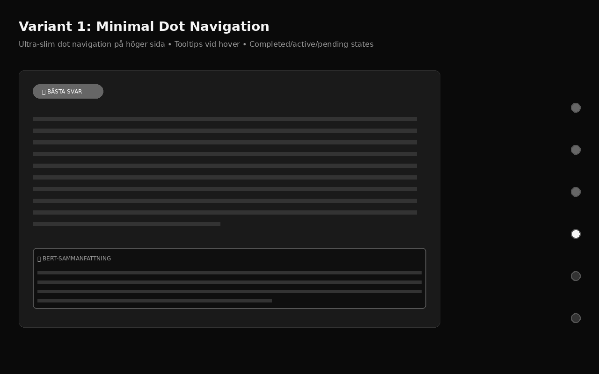

# OneSeek.AI - Chat Timeline Variants

## 5 Timeline-navigeringar med Koncept 3 Chat Area

Dessa 5 varianter använder alla den **rika kortdesignen från Koncept 3** för chatområdet (med bästa svar, BERT-sammanfattning, confidence scores, etc.), men med olika timeline-navigeringar.

---

## Variant 1: Minimal Dot Navigation

### Koncept
- **Ultra-slim dot navigation** på höger sida (bara 12px dots)
- Tooltips visar stegnamn vid hover
- Connecting lines mellan dots
- Visuell hierarki: completed (grå) / active (vit, glow) / pending (mörk grå)

### Styrkor
- ⭐⭐⭐⭐⭐ **Minimal footprint** - tar nästan ingen plats
- ⭐⭐⭐⭐ Elegant och diskret
- ⭐⭐⭐⭐ Passar perfekt till minimalistisk design

### Svagheter
- Kräver hover för att se labels
- Kan vara svår att klicka (små targets)

[View Interactive Demo](chat-timeline-variant-1.html)

---

## Variant 2: Vertical Progress Bar

### Koncept
- **Vertikal progress bar** (80px bred) på höger sida
- Fylld gradient visar framsteg
- Numeriska indikatorer för varje steg
- Animerad progress fill

### Styrkor
- ⭐⭐⭐⭐⭐ **Tydlig visuell feedback** på framsteg
- ⭐⭐⭐⭐⭐ Enkel att förstå (progress bar = universell UX pattern)
- ⭐⭐⭐⭐ Kompakt men läsbar

### Svagheter
- Tar mer plats än dots (80px vs 12px)

[View Interactive Demo](chat-timeline-variant-2.html)

---

## Variant 3: Floating Tab Bar

### Koncept
- **Floating pill bar** längst ner (fast positioned)
- Kompakta flikar med checkmarks
- Modern "floating" design
- Mobil-vänlig layout

### Styrkor
- ⭐⭐⭐⭐⭐ **Maximalt chatutrymme** (ingen sidopanel)
- ⭐⭐⭐⭐⭐ Modern Netflix/Spotify-liknande känsla
- ⭐⭐⭐⭐⭐ Perfekt för mobil (touch-vänlig)
- ⭐⭐⭐⭐ Alltid synlig utan att distrahera

### Svagheter
- Begränsat utrymme för labels (måste vara korta)
- Kan bli trångt med 10+ agenter

[View Interactive Demo](chat-timeline-variant-3.html)

---

## Variant 4: Accordion Sidebar

### Koncept
- **Expanderbar sidebar** (60px → 280px vid hover)
- Accordion-stil med ikoner och labels
- Plats-effektiv lösning
- Border-left accent för active item

### Styrkor
- ⭐⭐⭐⭐⭐ **Bästa av två världar** - kompakt + informativ
- ⭐⭐⭐⭐ Smart användning av hover-state
- ⭐⭐⭐⭐ Skalbar för många steg

### Svagheter
- Kräver hover för att se full info
- Kan vara mindre uppenbar för nya användare

[View Interactive Demo](chat-timeline-variant-4.html)

---

## Variant 5: Bottom Drawer

### Koncept
- **Drawer som expanderar uppåt** vid hover (80px → 240px)
- Grid-layout visar alla steg samtidigt
- Drag handle för att indikera interaktivitet
- Mobilapplikations-känsla

### Styrkor
- ⭐⭐⭐⭐⭐ **Stor översikt** när expanderad (grid view)
- ⭐⭐⭐⭐ Känns som native mobilapp
- ⭐⭐⭐⭐ Touch-friendly design
- ⭐⭐⭐⭐ Kompakt när kollapsad

### Svagheter
- Kan kännas "hidden" för desktop-användare
- Kräver interaction för att se detaljer

[View Interactive Demo](chat-timeline-variant-5.html)

---

## Jämförelsetabell

| Kriterie | Variant 1 Dots | Variant 2 Progress | Variant 3 Floating | Variant 4 Accordion | Variant 5 Drawer |
|----------|-------------------|----------------------|---------------------|---------------------|-------------------|
| **Minimal footprint** | ⭐⭐⭐⭐⭐ | ⭐⭐⭐ | ⭐⭐⭐⭐⭐ | ⭐⭐⭐⭐ | ⭐⭐⭐⭐⭐ |
| **Visuell feedback** | ⭐⭐⭐ | ⭐⭐⭐⭐⭐ | ⭐⭐⭐⭐ | ⭐⭐⭐⭐ | ⭐⭐⭐⭐⭐ |
| **Läskurva** | ⭐⭐⭐⭐ | ⭐⭐⭐⭐⭐ | ⭐⭐⭐⭐⭐ | ⭐⭐⭐ | ⭐⭐⭐⭐ |
| **Skalbarhet (10+ steg)** | ⭐⭐⭐⭐⭐ | ⭐⭐⭐⭐ | ⭐⭐⭐ | ⭐⭐⭐⭐⭐ | ⭐⭐⭐⭐ |
| **Mobil-vänlig** | ⭐⭐ | ⭐⭐⭐ | ⭐⭐⭐⭐⭐ | ⭐⭐⭐ | ⭐⭐⭐⭐⭐ |
| **Desktop-vänlig** | ⭐⭐⭐⭐⭐ | ⭐⭐⭐⭐⭐ | ⭐⭐⭐⭐ | ⭐⭐⭐⭐⭐ | ⭐⭐⭐⭐ |
| **Hover required** | Ja (tooltips) | Nej | Nej | Ja (expand) | Ja (expand) |
| **Alltid synlig** | Ja | Ja | Ja | Delvis | Delvis |

---

## Rekommendationer

### För Desktop-First:
1. **Variant 2: Progress Bar** - Tydligast visuell feedback, enkel att förstå
2. **Variant 4: Accordion Sidebar** - Bästa balansen mellan kompakt och informativ

### För Mobil-First:
1. **Variant 3: Floating Tab Bar** - Modern, touch-vänlig, maximalt chatutrymme
2. **Variant 5: Bottom Drawer** - Native app-känsla, grid overview

### För Minimal Design:
1. **Variant 1: Dot Navigation** - Absolutt minsta footprint
2. **Variant 4: Accordion Sidebar** - Kompakt när behövs, informativ vid hover

### För Transparens/Power Users:
1. **Variant 5: Bottom Drawer** - Visar alla steg i grid när expanderad
2. **Variant 2: Progress Bar** - Kontinuerlig visuell feedback

---

## Gemensamma Designprinciper

Alla varianter följer:

✅ **Grayscale-only** (#0a0a0a till #f5f5f5)
✅ **Samma rika chat area** från Koncept 3
✅ **Smooth transitions** (200-500ms)
✅ **Tydlig state-markering** (completed/active/pending)
✅ **Minimalistisk estetik**
✅ **Hover states** för interaktivitet

---

## Nästa Steg

1. **Välj en variant** baserat på era prioriteringar
2. **Testa interaktiva demos** för att känna på UX
3. **Implementera i React** med faktisk data från backend
4. **A/B-testa** olika varianter med användare

---

**Vill du kombinera element från flera varianter?** Det går att blanda! Till exempel:
- Variant 2 progress bar + Variant 1 dots för dubbel feedback
- Variant 3 floating tabs + Variant 5 drawer för desktop/mobil responsive

Låt mig veta vilken variant (eller kombination) du föredrar! 🚀
