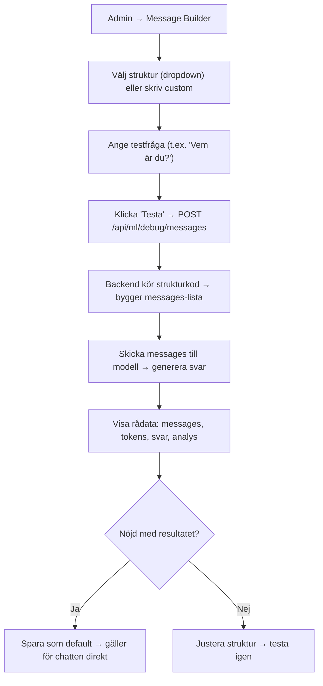

# Message Builder Debugger – Guide

## Översikt

Message Builder Debugger är ett realtids-verktyg i Admin Dashboard för att testa och optimera `messages`-strukturer (system, history, user) utan omstart. Detta löser problem som uppstod i PR #95, t.ex. self-referential loops och eko-effekter.

## Bakgrund: Problemet från PR #95

I PR #95 experimenterade vi med prompt-strukturer för att undvika self-referential loops:
- Modellen upprepade "Användare: ... OneSeek: ..." i sina svar
- Ren text-konkatenering utan roll-taggar ledde till:
  - Modellen tappade identitet
  - Repeterade fraser
  - Blandade engelska/svenska
  - Låg confidence (15%)
  - Hallucinationer

**Lösning:** Message Builder Debugger – testa strukturer live utan omstart.

## Funktioner

### 1. Bygga och testa messages-listor

Välj mellan fördefinierade strukturer eller skriv egen kod:

| Struktur | Beskrivning | Användningsfall |
|----------|-------------|-----------------|
| **Clean** | Minimal: system + user | Enkla frågor |
| **With Memory** | Inkluderar 5 historiska meddelanden | Uppföljningsfrågor |
| **With Context** | Lägger till tid/datum | Tidskänsliga frågor |
| **No Tags** | Utan roll-taggar | ⚠️ Experimentell |
| **Swedish Strict** | Forcerar svenska svar | Undvik engelska läckage |

### 2. Visa rå output från modellen

För varje test ser du:
- **Messages:** Den faktiska listan som skickas till modellen
- **Modellsvar:** Rå text-output
- **Tokens:** Antal genererade tokens
- **Latens:** Tid i millisekunder

### 3. Jämföra strukturer

Testa flera strukturer och jämför:
- **Svenska %:** Hur mycket av svaret är på svenska
- **Förtroende:** Estimerat konfidenspoäng
- **Loops:** Om svaret innehåller eko/repetitioner
- **Ord:** Ordantal

### 4. Spara bästa strukturen som default

Klicka "Spara som default" för att tillämpa strukturen på all inference – direkt utan omstart.

## Flöde



## API-endpoints

### GET /api/ml/debug/messages/templates

Hämta tillgängliga strukturmallar.

```bash
curl http://localhost:5000/api/ml/debug/messages/templates
```

### GET /api/ml/debug/messages/default

Hämta nuvarande default-struktur.

```bash
curl http://localhost:5000/api/ml/debug/messages/default
```

### POST /api/ml/debug/messages/default

Spara en struktur som default.

```bash
curl -X POST http://localhost:5000/api/ml/debug/messages/default \
  -H "Content-Type: application/json" \
  -d '{"name": "clean", "code": "[{\"role\": \"system\", \"content\": system_prompt}, {\"role\": \"user\", \"content\": user_message}]"}'
```

### POST /api/ml/debug/messages

Testa en struktur med modellen.

```bash
curl -X POST http://localhost:5000/api/ml/debug/messages \
  -H "Content-Type: application/json" \
  -d '{
    "structure_code": "[{\"role\": \"system\", \"content\": system_prompt}, {\"role\": \"user\", \"content\": user_message}]",
    "system_prompt": "Du är OneSeek-7B-Zero, en hjälpsam svensk AI.",
    "user_message": "Vem är du?"
  }'
```

## Exempel på strukturer

### Clean (Rekommenderad för de flesta fall)

```python
[
    {"role": "system", "content": system_prompt},
    {"role": "user", "content": user_message}
]
```

### With Memory

```python
[
    {"role": "system", "content": system_prompt},
    *[{"role": m["role"], "content": m["content"]} for m in history[-5:]],
    {"role": "user", "content": user_message}
]
```

### Swedish Strict

```python
[
    {"role": "system", "content": "Du pratar alltid svenska. Inga engelska ord.\n\n" + system_prompt},
    {"role": "user", "content": user_message}
]
```

### Custom exempel: Med topic-kontext

```python
messages = []
messages.append({"role": "system", "content": system_prompt})

# Lägg till topic-kontext om tillgängligt
if topic_context:
    messages.append({"role": "system", "content": f"[Topic: {topic_context}]"})

# Lägg till historik
for msg in history[-5:]:
    messages.append({"role": msg["role"], "content": msg["content"]})

messages.append({"role": "user", "content": user_message})
```

## Felsökning

### Problem: Modellen svarar på engelska

**Lösning:** Använd "Swedish Strict" strukturen som forcerar svenska.

### Problem: Modellen upprepar frågan (loops)

**Lösning:** 
1. Använd "Clean" strukturen utan roll-taggar i historik
2. Se till att systemprompten är tydlig med "Svara kort och koncist"
3. Undvik "No Tags" strukturen

### Problem: Modellen tappar identitet

**Lösning:**
1. Se till att systemprompten alltid är först i messages-listan
2. Inkludera identitetsinformation i prompten: "Du är OneSeek-7B-Zero, en svensk AI-assistent."

### Problem: Låg confidence

**Kontrollera:**
1. Att modellen svarar på svenska (>80% swedish_percentage)
2. Att det inte finns loops (has_loops = false)
3. Att svaret är lagom långt (50-200 ord)

## Konfigurationsfil

Default-strukturen sparas i: `config/message_structure.json`

```json
{
  "default_structure": {
    "name": "clean",
    "code": "[{\"role\": \"system\", \"content\": system_prompt}, {\"role\": \"user\", \"content\": user_message}]",
    "saved_at": "2025-12-02T10:30:00.000Z"
  }
}
```

## Integration med Δ+

Message Builder integrerar med andra Δ+ moduler:
- **Intent Engine:** Använder detekterad intent för kontext
- **Memory Manager:** Hämtar historik baserat på topic_hash
- **Cache Manager:** Kan rensa cache efter strukturändring
- **Confidence Calculator:** Analyserar svarskvalitet

## Best Practices

1. **Börja enkelt:** Starta med "Clean" strukturen
2. **Testa ofta:** Kör samma fråga med olika strukturer
3. **Jämför metrics:** Titta på svenska %, confidence och loops
4. **Spara när nöjd:** Klicka "Spara som default" för produktion
5. **Rensa cache:** Efter strukturändring, rensa cachen för nya svar
